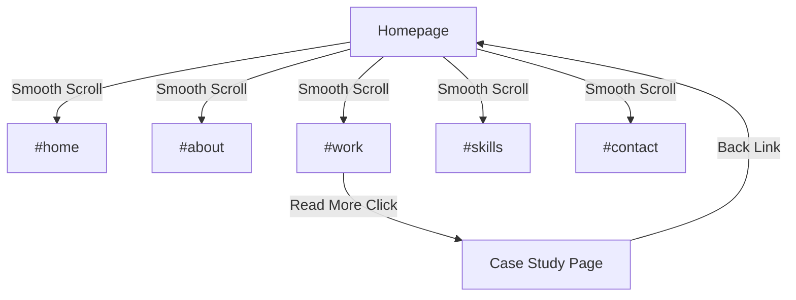

# Design Document: Elegant Portfolio

## Overview

This design transforms Victor Munene's data analyst portfolio into a hybrid single-page experience. The homepage contains all main sections accessible via smooth scroll navigation, while detailed project case studies exist as separate pages accessed only through explicit "Read More" links. The design emphasizes minimalism, performance, and a professional executive-summary format for case studies.

## Architecture

### Page Structure

```
┌─────────────────────────────────────────────────────────────┐
│                    SINGLE-PAGE HOMEPAGE                      │
├─────────────────────────────────────────────────────────────┤
│  ┌─────────────────────────────────────────────────────┐   │
│  │ Sticky Header (smooth scroll nav)                    │   │
│  └─────────────────────────────────────────────────────┘   │
│  ┌─────────────────────────────────────────────────────┐   │
│  │ Hero Section (#home)                                 │   │
│  │ - Name, Title, Tagline, Social Links                │   │
│  └─────────────────────────────────────────────────────┘   │
│  ┌─────────────────────────────────────────────────────┐   │
│  │ About Section (#about)                               │   │
│  │ - Brief bio, years experience, specializations      │   │
│  └─────────────────────────────────────────────────────┘   │
│  ┌─────────────────────────────────────────────────────┐   │
│  │ Projects Section (#work)                             │   │
│  │ - 6 Project Cards with "Read More" links            │   │
│  └─────────────────────────────────────────────────────┘   │
│  ┌─────────────────────────────────────────────────────┐   │
│  │ Skills Section (#skills)                             │   │
│  │ - 6 core competencies grouped by category           │   │
│  └─────────────────────────────────────────────────────┘   │
│  ┌─────────────────────────────────────────────────────┐   │
│  │ Contact Section (#contact)                           │   │
│  │ - CTA, inline form, email/LinkedIn                  │   │
│  └─────────────────────────────────────────────────────┘   │
│  ┌─────────────────────────────────────────────────────┐   │
│  │ Footer                                               │   │
│  └─────────────────────────────────────────────────────┘   │
└─────────────────────────────────────────────────────────────┘

┌─────────────────────────────────────────────────────────────┐
│              CASE STUDY PAGE (per project)                   │
├─────────────────────────────────────────────────────────────┤
│  ┌─────────────────────────────────────────────────────┐   │
│  │ Header with "Back to Portfolio" link                 │   │
│  └─────────────────────────────────────────────────────┘   │
│  ┌─────────────────────────────────────────────────────┐   │
│  │ 1. Background/Introduction (2-3 paragraphs)         │   │
│  └─────────────────────────────────────────────────────┘   │
│  ┌─────────────────────────────────────────────────────┐   │
│  │ 2. Methods (analytical approach, tools)             │   │
│  └─────────────────────────────────────────────────────┘   │
│  ┌─────────────────────────────────────────────────────┐   │
│  │ 3. Results (2-4 visualizations/graphs)              │   │
│  └─────────────────────────────────────────────────────┘   │
│  ┌─────────────────────────────────────────────────────┐   │
│  │ 4. Business Recommendations                          │   │
│  └─────────────────────────────────────────────────────┘   │
│  ┌─────────────────────────────────────────────────────┐   │
│  │ Footer                                               │   │
│  └─────────────────────────────────────────────────────┘   │
└─────────────────────────────────────────────────────────────┘
```

### Routing Structure

```
/                           → Homepage (single-page with all sections)
/project/:slug              → Case Study Page (detailed project view)
```

### Navigation Flow



## Components and Interfaces

### Core Components

#### 1. StickyHeader
```typescript
interface StickyHeaderProps {
  navItems: NavItem[];
  activeSection: string;
  onNavClick: (sectionId: string) => void;
}

interface NavItem {
  id: string;      // e.g., "home", "about", "work"
  label: string;   // e.g., "Home", "About", "Work"
}
```

#### 2. HeroSection
```typescript
interface HeroSectionProps {
  name: string;
  title: string;
  tagline: string;        // Max 15 words
  socialLinks: SocialLink[];
  backgroundImage?: string;
}

interface SocialLink {
  platform: 'linkedin' | 'github' | 'twitter';
  url: string;
  icon: string;
}
```

#### 3. AboutSection
```typescript
interface AboutSectionProps {
  bio: string;            // Max 100 words
  yearsExperience: number;
  specializations: string[];
  photo?: string;
}
```

#### 4. ProjectCard
```typescript
interface ProjectCardProps {
  project: Project;
  onReadMoreClick: (slug: string) => void;
}

interface Project {
  id: string;
  slug: string;
  title: string;
  category: string[];
  description: string;    // One-line description
  thumbnail: string;
  caseStudy: CaseStudy;
}
```

#### 5. ProjectsSection
```typescript
interface ProjectsSectionProps {
  projects: Project[];    // Max 6 displayed
}
```

#### 6. SkillsSection
```typescript
interface SkillsSectionProps {
  skills: SkillGroup[];   // Max 6 total skills across groups
}

interface SkillGroup {
  category: 'BI Tools' | 'Data Skills' | 'Platforms';
  items: Skill[];
}

interface Skill {
  name: string;
  level: number;          // 0-100
  icon?: string;
}
```

#### 7. ContactSection
```typescript
interface ContactSectionProps {
  email: string;
  linkedInUrl: string;
  ctaText: string;
  onFormSubmit: (data: ContactFormData) => Promise<FormResponse>;
}

interface ContactFormData {
  name: string;
  email: string;
  message: string;
}

interface FormResponse {
  success: boolean;
  message: string;
}
```

#### 8. CaseStudyPage
```typescript
interface CaseStudyPageProps {
  project: Project;
}

interface CaseStudy {
  background: string[];   // 2-3 paragraphs
  methods: {
    approach: string;
    tools: string[];
  };
  results: {
    description: string;
    visualizations: Visualization[];  // 2-4 items
  };
  recommendations: string[];
}

interface Visualization {
  type: 'chart' | 'graph' | 'dashboard' | 'image';
  src: string;
  alt: string;
  caption?: string;
}
```

## Data Models

### Project Data Structure
```typescript
const projectsData: Project[] = [
  {
    id: "1",
    slug: "sales-performance-dashboard",
    title: "Sales Performance Dashboard",
    category: ["Power BI"],
    description: "Interactive dashboard for real-time sales tracking",
    thumbnail: "/assets/img/projects/sales-dashboard-thumb.webp",
    caseStudy: {
      background: [
        "A retail company struggled to track sales performance across 50+ stores...",
        "Leadership needed real-time visibility into KPIs...",
        "The existing Excel-based reporting was slow and error-prone..."
      ],
      methods: {
        approach: "Built a centralized Power BI solution with automated data refresh...",
        tools: ["Power BI", "SQL Server", "DAX", "Power Query"]
      },
      results: {
        description: "The dashboard reduced reporting time by 80%...",
        visualizations: [
          { type: "dashboard", src: "/assets/img/projects/sales-main.webp", alt: "Main sales dashboard" },
          { type: "chart", src: "/assets/img/projects/sales-trend.webp", alt: "Sales trend analysis" }
        ]
      },
      recommendations: [
        "Implement automated alerts for underperforming stores",
        "Expand dashboard to include inventory metrics",
        "Train regional managers on self-service analytics"
      ]
    }
  }
  // ... more projects
];
```

### Navigation Data
```typescript
const navItems: NavItem[] = [
  { id: "home", label: "Home" },
  { id: "about", label: "About" },
  { id: "work", label: "Work" },
  { id: "skills", label: "Skills" },
  { id: "contact", label: "Contact" }
];
```

### Skills Data
```typescript
const skillsData: SkillGroup[] = [
  {
    category: "BI Tools",
    items: [
      { name: "Power BI", level: 95 },
      { name: "Tableau", level: 85 }
    ]
  },
  {
    category: "Data Skills",
    items: [
      { name: "SQL", level: 90 },
      { name: "Data Modeling", level: 88 }
    ]
  },
  {
    category: "Platforms",
    items: [
      { name: "BC Central", level: 80 },
      { name: "Dynamics Navision", level: 75 }
    ]
  }
];
```

## Correctness Properties

*A property is a characteristic or behavior that should hold true across all valid executions of a system-essentially, a formal statement about what the system should do. Properties serve as the bridge between human-readable specifications and machine-verifiable correctness guarantees.*

Based on the prework analysis, the following properties can be verified through property-based testing:

### Property 1: Hero tagline word limit
*For any* hero section content, the tagline text SHALL contain fewer than 15 words.
**Validates: Requirements 1.3**

### Property 2: Project card limit
*For any* array of projects passed to ProjectsSection, the rendered output SHALL display at most 6 project cards.
**Validates: Requirements 2.1**

### Property 3: Project card completeness
*For any* project card rendered, the output SHALL contain a preview image, project title, at least one technology category, and a description.
**Validates: Requirements 2.2**

### Property 4: Read More navigation correctness
*For any* project with a "Read More" link, clicking the link SHALL navigate to a URL matching the pattern `/project/{project.slug}`.
**Validates: Requirements 2.5, 7.1**

### Property 5: About section word limit
*For any* about section content, the bio text SHALL contain fewer than 100 words.
**Validates: Requirements 4.1**

### Property 6: Skills display limit
*For any* skills data passed to SkillsSection, the rendered output SHALL display at most 6 skill items total.
**Validates: Requirements 5.1**

### Property 7: Skills grouping
*For any* skills data, each skill item SHALL be associated with exactly one category from the set {BI Tools, Data Skills, Platforms}.
**Validates: Requirements 5.3**

### Property 8: Contact form feedback
*For any* contact form submission (valid or invalid), the form SHALL display a feedback message indicating success or error.
**Validates: Requirements 6.3**

### Property 9: Case study section completeness
*For any* case study page, the rendered output SHALL contain all four sections: Background, Methods, Results, and Recommendations.
**Validates: Requirements 7.2**

### Property 10: Background paragraph count
*For any* case study background section, the content SHALL contain between 2 and 3 paragraphs (inclusive).
**Validates: Requirements 7.3**

### Property 11: Results visualization count
*For any* case study results section, the content SHALL contain between 2 and 4 visualizations (inclusive).
**Validates: Requirements 7.5**

### Property 12: Image lazy loading
*For any* image element positioned below the initial viewport fold, the element SHALL have the `loading="lazy"` attribute.
**Validates: Requirements 8.2**

### Property 13: Animation duration limit
*For any* CSS transition applied to elements, the duration SHALL be 300ms or less.
**Validates: Requirements 8.3**

### Property 14: Font family limit
*For any* valid stylesheet, the total count of unique font families used SHALL be at most 2.
**Validates: Requirements 9.1**

## Error Handling

### Form Submission Errors
- Network failures: Display "Unable to send message. Please try again or email directly."
- Validation errors: Highlight invalid fields with inline error messages
- Server errors: Display generic error with fallback contact options

### Image Loading Errors
- Use placeholder images with graceful fallback
- Implement skeleton loading states for images

### Navigation Errors
- Invalid section IDs: Scroll to top of page
- Missing project slugs: Redirect to homepage with toast notification

## Testing Strategy

### Dual Testing Approach

This project uses both unit tests and property-based tests for comprehensive coverage:

- **Unit tests**: Verify specific examples, edge cases, and integration points
- **Property-based tests**: Verify universal properties that should hold across all inputs

### Testing Framework

- **Unit Testing**: Jest + React Testing Library (already configured in project)
- **Property-Based Testing**: fast-check (to be added)
  - Minimum 100 iterations per property test
  - Each property test tagged with format: `**Feature: elegant-portfolio, Property {number}: {property_text}**`

### Unit Test Coverage

1. **Component Rendering**
   - Hero section renders with required elements
   - Navigation items render correctly
   - Project cards display all required fields
   - Case study pages render all four sections

2. **User Interactions**
   - Smooth scroll navigation works correctly
   - "Read More" links navigate to correct URLs
   - Contact form submission and feedback
   - Mobile hamburger menu toggle

3. **Edge Cases**
   - Empty project array handling
   - Missing optional fields (photo, icon)
   - Form validation edge cases

### Property-Based Test Coverage

Each correctness property (1-14) will have a corresponding property-based test that:
1. Generates random valid inputs using fast-check arbitraries
2. Verifies the property holds for all generated inputs
3. Reports counterexamples if property violations are found

### Test File Structure
```
src/
├── __tests__/
│   ├── components/
│   │   ├── HeroSection.test.tsx
│   │   ├── ProjectCard.test.tsx
│   │   ├── SkillsSection.test.tsx
│   │   └── ContactForm.test.tsx
│   ├── properties/
│   │   ├── hero.property.test.ts
│   │   ├── projects.property.test.ts
│   │   ├── skills.property.test.ts
│   │   ├── caseStudy.property.test.ts
│   │   └── styling.property.test.ts
│   └── pages/
│       ├── Home.test.tsx
│       └── CaseStudy.test.tsx
```
